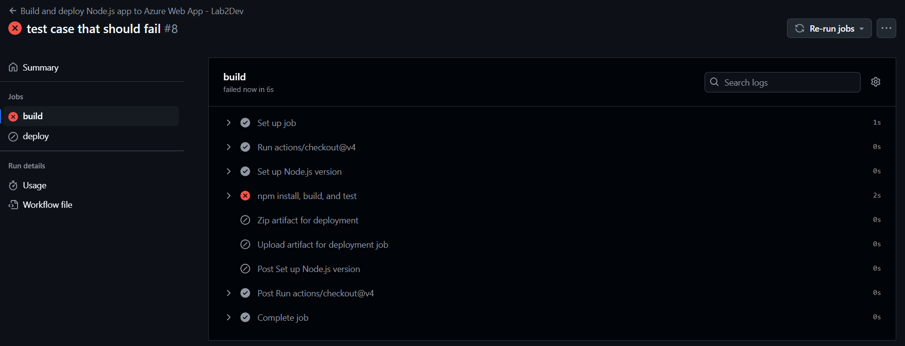
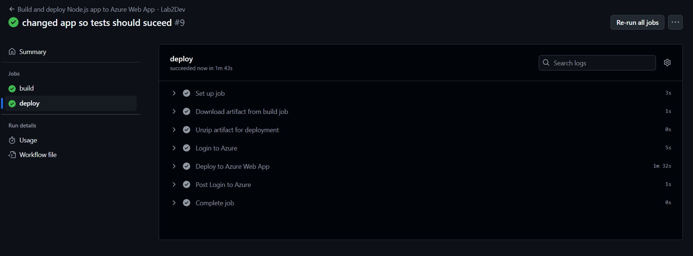
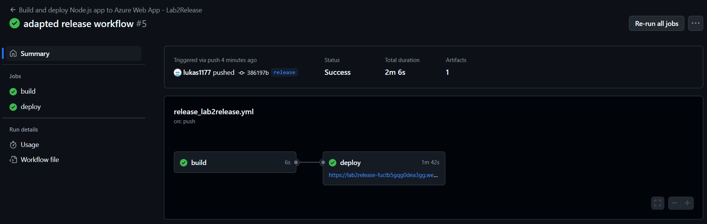

# Lab2

For clarification, I used Web Apps instead of Static Web Apps since it didn't work in Static Web Apps but I assumed the deployment process is similar.

## Links to Azure Web Apps

### Dev Web App
https://lab2dev-hpe2fygdgng3gght.westeurope-01.azurewebsites.net/

### Release Web App
https://lab2release-fuctb5gqg0dea3gg.westeurope-01.azurewebsites.net/

## Screenshots

### Screenshot of a failed deployment because of a failed test

### Screenshot of a succeeded deployment in the dev web app

### Screenshot of a succeeded deployment in the release web app

## How Releases work
There is a workflow file in the release branch which achieves that for every commit in this branch, so also when code is merged into this branch, the code is deployed to the release web app.