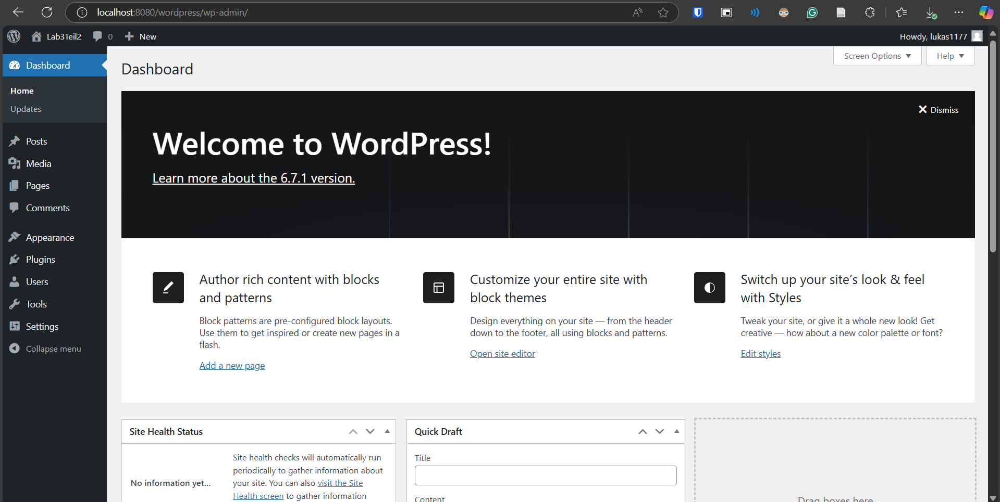

# Lab 3

## Part 1

Added docker compose file to `Lab3/Teil1` that creates wordpress and mysql containers.  
Started containers with the command `docker compose up -d`.  
Accessed wordpress site on `localhost:8080` and completed the setup process.

## Part 2

Used mariadb as database as it can be more easily installed on debian.

Added dockerfiles for mariadb and wordpress.  
Added init.sql and my.cnf to the mariadb folder. These files achieve that the database can be reached from outside and that wordpress is able to access the database.
Added docker-compose file.

Built containers with `docker compose build`.  
Started containers with `docker compose up -d`.

Accessed wordpress website on `localhost:8080` and completed the setup process. There, the database information is entered as it wasn't inferred automatically but the connection works and the site can be set up as can be seen in the image below.

