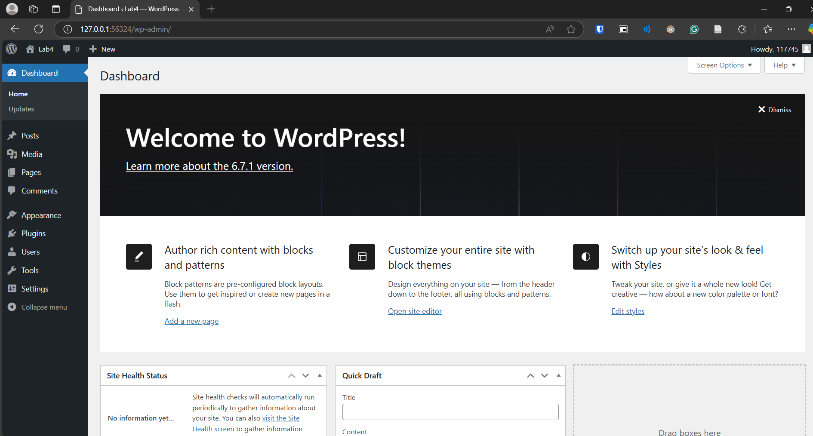
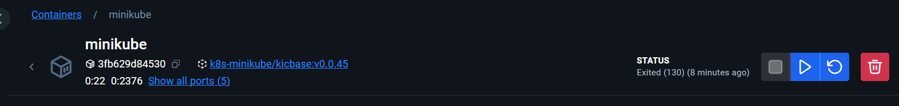

# Lab4

This Lab demonstrates deploying a WordPress application with MySQL on a local Kubernetes cluster using Minikube.

## Prerequisites
- Minikube
- Kubectl
- Docker Desktop

Docker Desktop was already installed from previous labs. Minikube and kubectl were installed with the chocolatey package manager using the command `choco install minikube kubernetes-cli`. Docker was used to run Minikube because my windows version did not support running it with other options like HyperV.

## Deployment files

Deployment files were added for mysql and wordpress. These files define the ports, a persistent storage and the user credentials for the mysql database and wordpress.

## Deployment Steps

1. Start Minikube
```bash
minikube start --driver=docker
```

2. Deploy MySQL
```bash
kubectl apply -f mysql-deployment.yaml
```

3. Deploy WordPress
```bash
kubectl apply -f wordpress-deployment.yaml
```

4. Verify Deployments
```bash
kubectl get pods

kubectl get services
```

5. Access WordPress (Opens Wordpress in browser)
```bash
minikube service wordpress-service
```

6. Ran setup process of Wordpress in browser.

After these steps the website was running successfully as can be seen in the screenshot below.



This is the running minikube container in docker desktop:
